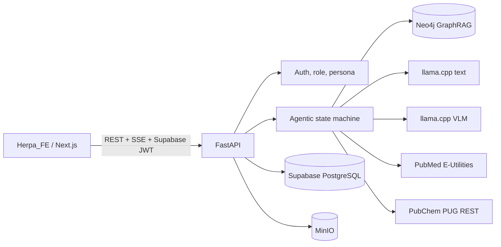

# HERPA Agentic AI + GraphRAG Backend

Backend FastAPI untuk frontend **Herpa_FE**, dengan local LLM/VLM melalui llama.cpp, knowledge graph Neo4j, data aplikasi Supabase, object storage MinIO, PubMed/PubChem tools, rekomendasi herbal berbasis grounding, chat SSE, attachment multimodal, kuis kimia bertingkat, dan dashboard admin.

> Sistem bersifat edukatif dan pendukung informasi. Sistem tidak boleh digunakan sebagai pengganti diagnosis, penanganan darurat, atau keputusan klinis profesional.

## Arsitektur



## Fitur utama

- Role `admin` dan `user`, dengan persona `umum`, `pelajar`, `peneliti`, dan `tenaga_medis`.
- GraphRAG Neo4j dengan allowlisted parameterized Cypher; model tidak dapat menjalankan Cypher arbitrer.
- Chat CRUD, rename, pin, soft delete, share token ter-hash, dan SSE.
- Attachment PDF, DOCX, XLSX, CSV, TXT/MD, serta gambar/VLM.
- Rekomendasi herbal dengan red-flag screening, contraindication/interaksi lookup, evidence level, dan sumber.
- PubMed dan PubChem native tools berdasarkan persona/intent.
- Quiz kimia bertingkat, attempt, scoring, XP, progress, history, dan penghapusan history.
- Admin analytics, user management, audit log, health dependency, dan storage summary.
- Supabase migration + RLS, Neo4j constraints/indexes/seed, Docker CPU/GPU, unit/contract/E2E mock tests.
- Compatibility routes untuk API yang sudah dipanggil oleh Herpa_FE.

## Struktur

```text
app/
├── api/                 # dependencies dan HTTP routes
├── agents/              # agent state machine
├── core/                # config, security, logging, exception
├── graph/               # Neo4j client, repository, retrieval, grounding
├── logic/               # use-case orchestrators
├── models/              # Pydantic request/response contracts
├── prompts/             # persona, safety, GraphRAG prompts
├── services/            # AI, Supabase, MinIO, docs, tools, analytics
├── workers/             # optional worker entry points
└── utils/
data_pipeline/           # dataset validation dan Neo4j ingestion
database/                # Supabase SQL dan Neo4j Cypher
frontend_patch/           # patch integrasi minimal untuk Herpa_FE
scripts/                  # setup, health, migration, seed, secret check
tests/                    # unit, contract, mock E2E, integration notes
docs/                     # audit, API, architecture, setup, security
```

## Prasyarat

- Python 3.11+
- Docker Desktop + Docker Compose v2
- Akun/project Supabase
- Neo4j Aura atau Neo4j server
- RAM yang cukup untuk model GGUF
- GPU opsional; CPU mode didukung

## Model

Letakkan file ini di folder `models/`:

```text
models/Qwen_Qwen3-4B-Instruct-2507-Q6_K.gguf
models/Qwen3-VL-4B-Instruct-Q4_K_M.gguf
models/mmproj-Qwen3VL-4B-Instruct-Q8_0.gguf
```

Model tidak disalin ke Docker image dan folder `models/` di-mount read-only.

## Setup Windows PowerShell

```powershell
cd Herpa_Agentic_GraphRAG_Backend
Copy-Item .env.example .env
notepad .env
powershell -ExecutionPolicy Bypass -File .\scripts\setup.ps1
```

Isi minimal:

- `SUPABASE_SERVICE_ROLE_KEY`
- `NEO4J_PASSWORD`
- `MINIO_ACCESS_KEY`
- `MINIO_SECRET_KEY`
- contact email NCBI

Lalu letakkan model GGUF di `models\`.

## Setup Linux/macOS

```bash
cd Herpa_Agentic_GraphRAG_Backend
cp .env.example .env
nano .env
./scripts/setup.sh
```

## Supabase migration

Jalankan SQL berikut secara berurutan melalui Supabase SQL Editor atau Supabase CLI:

```text
1. database/supabase/migrations/001_initial_schema.sql
2. database/supabase/functions/triggers.sql
3. database/supabase/policies/rls.sql
4. database/supabase/functions/admin.sql
5. database/supabase/seed.sql
```

Jangan menaruh service-role key di frontend. Frontend hanya menggunakan publishable key, dan semua tabel user-facing dilindungi RLS.

## Neo4j setup

Jalankan:

```text
database/neo4j/constraints.cypher
database/neo4j/indexes.cypher
database/neo4j/seed.cypher
```

Atau ingest dataset contoh:

```bash
python -m data_pipeline.ingest_neo4j
python -m data_pipeline.verify_graph
```

Dataset contoh hanya untuk smoke test; jangan dianggap sebagai basis medis lengkap.

Validasi schema enrichment v2 yang sudah ada tanpa mengubah data:

```text
1. Buka Neo4j Browser.
2. Paste isi database/neo4j/validate_enrichment_v2.cypher.
3. Jalankan per blok query untuk mengecek label, relasi, total herb, TraditionalUse, PreparationMethod, UsageGuideline, SafetyWarning, Claim, Evidence, Symptom, SymptomAlias, PopulationRisk, dan Audience.
```

Jangan menjalankan seed demo lama jika database sudah memakai `herpa_neo4j_full_enrichment_v2_SAFE_PATCHED`.

## Menjalankan dengan Docker

MinIO dan backend saja:

```bash
docker compose up -d minio minio-init
docker compose up -d --build backend
```

Dengan model teks:

```bash
docker compose --profile text up -d llama-text backend
```

Dengan model teks dan VLM:

```bash
docker compose --profile ai up -d llama-text llama-vlm backend
```

GPU CUDA:

```bash
docker compose -f docker-compose.yml -f docker-compose.gpu.yml --profile ai up -d
```

Periksa:

```bash
docker compose ps
docker compose logs -f backend
docker compose logs -f llama-text
docker compose logs -f llama-vlm
```

Image llama.cpp dapat dipin ke build/digest yang telah diuji pada deployment. Tag GPU harus cocok dengan versi CUDA host.

## Menjalankan tanpa Docker

Jalankan MinIO dan llama-server secara terpisah, lalu arahkan base URL `.env` ke host lokal:

```dotenv
MINIO_ENDPOINT=localhost:9000
LLAMA_TEXT_BASE_URL=http://localhost:8080/v1
LLAMA_VISION_BASE_URL=http://localhost:8081/v1
```

Kemudian:

```bash
python -m pip install -e ".[dev]"
uvicorn app.main:app --host 0.0.0.0 --port 8000 --reload
```

Dokumentasi API:

```text
http://localhost:8000/docs
http://localhost:8000/redoc
```

## Development mock mode

Mock mode hanya untuk test/local development dan tidak memakai layanan cloud atau model nyata:

```bash
APP_ENV=test ALLOW_MOCK_SERVICES=true uvicorn app.main:app --reload
```

Token mock:

```text
dev-user
dev-admin
```

Jangan mengaktifkan mock mode di production.

## Integrasi Herpa_FE

Tambahkan ke `.env.local` frontend:

```dotenv
NEXT_PUBLIC_API_URL=http://localhost:8000
NEXT_PUBLIC_SUPABASE_URL=https://qemidlrgqeumjblthvvp.supabase.co
NEXT_PUBLIC_SUPABASE_PUBLISHABLE_KEY=<SUPABASE_PUBLISHABLE_KEY>
```

Backend mendukung endpoint frontend lama seperti:

```text
/api/auth/*
/api/chat/*
/api/files/*
/api/admin/*
/api/herbal-recommendations/analyze
```

Sekaligus endpoint kanonik `/api/v1/*`. Patch contoh berada di `frontend_patch/`.

## Quality checks

```bash
python -m compileall app data_pipeline scripts
ruff check .
mypy app
pytest -q
python -m scripts.check_secrets
```

Hasil saat paket ini dibuat:

```text
compileall: passed
ruff: passed
mypy: passed (126 source files)
pytest: 14 passed
mock API smoke test: passed
```

Integration test ke Supabase, Neo4j, MinIO, PubMed/PubChem, dan model GGUF nyata harus dijalankan di lingkungan yang memiliki kredensial dan model tersebut.

## Health endpoints

```text
GET /api/v1/health/live
GET /api/v1/health/ready
GET /api/v1/health/dependencies
```

`ready` mengembalikan HTTP 503 bila dependency wajib belum siap.

## Troubleshooting singkat

- **Backend connection refused**: cek `docker compose ps` dan log backend.
- **Model unavailable**: cek nama file, mount `./models:/models:ro`, RAM/VRAM, serta health llama-server.
- **Neo4j error**: cek Aura URI `neo4j+s://`, username/password, dan nama database.
- **Supabase 401**: cek JWT issuer/audience/JWKS dan bearer token frontend.
- **Upload gagal**: cek bucket MinIO, quota user, MIME, ukuran, dan `MINIO_ENDPOINT` internal.
- **VLM tidak kompatibel**: pin build llama.cpp yang telah diuji terhadap Qwen3-VL dan mmproj tersebut.

Detail lebih lengkap tersedia di `docs/` dan `IMPLEMENTATION_REPORT.md`.
