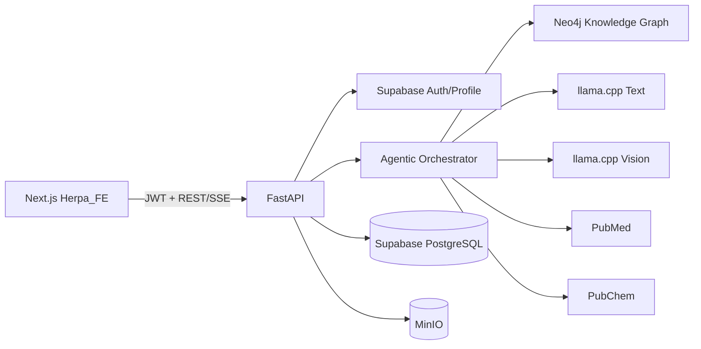

# Arsitektur HERPA

`app/api` hanya menangani HTTP. `app/logic` mengoordinasikan use case. `app/agents` menangani state machine. `app/graph` membatasi akses GraphRAG ke query template terparameter. `app/services` membungkus sistem eksternal. Model Pydantic menjadi kontrak lintas lapisan.
